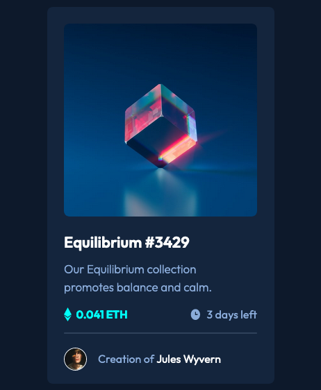
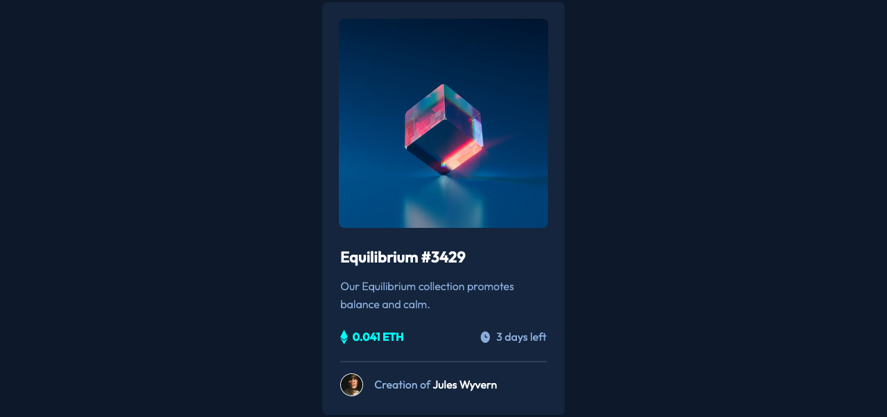

# Frontend Mentor - NFT preview card component solution

This is a solution to the [NFT preview card component challenge on Frontend Mentor](https://www.frontendmentor.io/challenges/nft-preview-card-component-SbdUL_w0U). Frontend Mentor challenges help you improve your coding skills by building realistic projects.

## Table of contents

- [Overview](#overview)
  - [Screenshot](#screenshot)
  - [Links](#links)
- [My process](#my-process)
  - [Built with](#built-with)
- [Author](#author)

**Note: Delete this note and update the table of contents based on what sections you keep.**

## Overview

### Screenshot

### Links

- Solution URL: [Github](https://github.com/hirohiro2255/NFT-preview-card-component)
- Live Site URL: [Netlify](https://keen-perlman-fe7088.netlify.app/)

## My process

### Built with

- Flexbox
- Mobile-first workflow

## Author

- Frontend Mentor - [@hirohiro2255](https://www.frontendmentor.io/profile/hirohiro2255)
